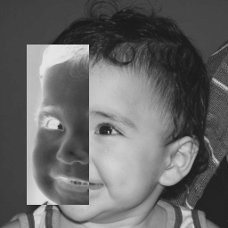
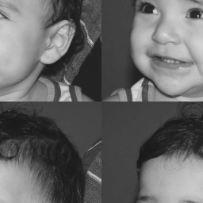
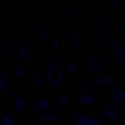
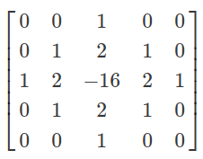
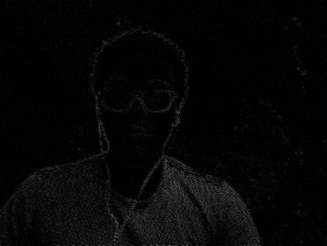
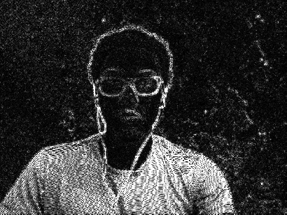
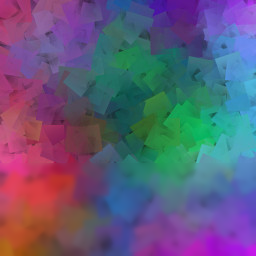

# PROCESSAMENTO DIGITAL DE IMAGENS
## Resolução dos exercicos práticos

## Tutorial 2
### Exemplo 2.1
Utilizando o programa exemplos/pixels.cpp como referência, implemente um programa regions.cpp. Esse programa deverá solicitar ao usuário as coordenadas de dois pontos P1 e P2 localizados dentro dos limites do tamanho da imagem e exibir que lhe for fornecida. Entretanto, a região definida pelo retângulo de vértices opostos definidos pelos pontos P1 e P2 será exibida com o negativo da imagem na região correspondente.

**implementação em c++**
~~~c++
#include <iostream>
#include <opencv2/opencv.hpp>

using namespace cv;
using namespace std;

int main(int argc, char* argv[]) {
    
    int p1x, p1y, p2x, p2y;
    cout << "Coordenadas de P1: ";
    cin >> p1y >> p1x;

    cout << "Coordenadas de P2: ";
    cin >> p2y >> p2x;
    
    cv::Mat image;
    image = cv::imread(argv[1],cv::IMREAD_GRAYSCALE);

    if(!image.data)
        std::cout << "Não abriu " << argv[1] << std::endl;
    
    cv::namedWindow("janela", cv::WINDOW_AUTOSIZE);

    for (int i = p1x; i < p2x; i++) {
        for (int j = p1y; j < p2y; j++) {
            image.at<uchar>(i,j) = 255 - image.at<uchar>(i,j);
        }
    }

    cv::imshow("janela", image);
    cv::waitKey();

    return 0; 
}
~~~

**exemplo de entrada**
~~~
cyber pixels 
$ ./regions biel.png 
Coordenadas de P1: 30 50
Coordenadas de P2: 100 230
~~~

**Comparações entre a imagem original e o resultado obtido**

 

### Exemplo 2.2
Utilizando o programa exemplos/pixels.cpp como referência, implemente um programa trocaregioes.cpp. Seu programa deverá trocar os quadrantes em diagonal na imagem.

**implementação em c++**
~~~c++
#include <iostream>
#include <opencv2/opencv.hpp>

using namespace cv;
using namespace std;

int main(int argc, char* argv[]) {
    
    cv::Mat image;
    
    image= cv::imread(argv[1],cv::IMREAD_GRAYSCALE);
    if(!image.data)
        std::cout << "nao abriu " << argv[1] << std::endl;

    int r = image.rows;
    int c = image.cols;
    uchar aux;
    
    for(int i = 0; i < c/2; i++){
        for(int j = 0; j < r/2; j++){
            aux = image.at<uchar>(i,j);
            image.at<uchar>(i,j) = image.at<uchar>(i+c/2,j+r/2);
            image.at<uchar>(i+c/2,j+r/2) = aux;
        }
    }
    
    for(int i = 0; i < c/2; i++){
        for(int j = 0; j < r/2; j++){
            aux = image.at<uchar>(i,j+c/2);
            image.at<uchar>(i,j+c/2) = image.at<uchar>(i+r/2,j);
            image.at<uchar>(i+r/2,j) = aux;
        }
    }

    cv::imshow("janela", image);
    cv::waitKey();

    return 0; 
}
~~~

**exemplo de entrada**
~~~
cyber pixels 
$ ./trocaregioes biel.png
~~~

**Resultados**

## Tutorial 3
### Exemplo 3.1
Observando-se o programa labeling.cpp como exemplo, é possível verificar que caso existam mais de 255 objetos na cena, o processo de rotulação poderá ficar comprometido. Identifique a situação em que isso ocorre e proponha uma solução para este problema.

**R.:** Como nós estamos rotulando as bolhas utilizando as cores apenas na escala de cinza (0 à 255), excluindo o 0 pois é a cor do fundo, esse processo só funciona se tivermos ate 255 bolhas na tela. A solução proposta é usar todas a escolas de cores do RGB, tendo asssim um número incrivelmente grande de cores possíveis para rotular os objetos. Usando esse método podemos rotular até 255^3 objetos. O código abaixo implementa essa funcionalidade.

~~~c++
#include <iostream>
#include <opencv2/opencv.hpp>

using namespace cv;

int main(int argc, char** argv){
  cv::Mat image, realce;
  int width, height;
  int nobjects;
  cv::Vec3b objcolor;
  cv::Vec3b branco;

  cv::Point p;
  image = cv::imread(argv[1], cv::IMREAD_COLOR);

  if(!image.data){
    std::cout << "imagem nao carregou corretamente\n";
    return(-1);
  }

  width=image.cols;
  height=image.rows;
  std::cout << width << "x" << height << std::endl;

  p.x=0;
  p.y=0;

  // busca objetos presentes
  nobjects=0;
  
  int b=0;
  int g=0;
  int r=0;
  objcolor[0]=b;
  objcolor[1]=g;
  objcolor[2]=r;

  branco[0]=255;
  branco[1]=255;
  branco[2]=255;

  for(int i=0; i<height; i++){
    for(int j=0; j<width; j++){
      if(image.at<Vec3b>(i,j) == branco){
        // achou um objeto
        nobjects++;
        b+=1;
        if(b==255) {
            g++;
            b=0;
        }else if(b==255 && r==255) {
            r++;
            b=0;
            g=0;
        }

        objcolor[0]=b;
        objcolor[1]=g;
        objcolor[2]=r;
        p.x=j;
        p.y=i;
  		// preenche o objeto com o contador
		cv::floodFill(image, p, objcolor);
      }
    }
  }
  std::cout << "a figura tem " << nobjects << " bolhas\n";
  cv::imshow("image", image);
  cv::imwrite("labeling.png", image);
  cv::waitKey();

  return 0;
}
~~~

**Resultados**

 

## Tutorial 4
### Exemplo 4.1
Utilizando o programa exemplos/histogram.cpp como referência, implemente um programa equalize.cpp. Este deverá, para cada imagem capturada, realizar a equalização do histogram antes de exibir a imagem. Teste sua implementação apontando a câmera para ambientes com iluminações variadas e observando o efeito gerado. Assuma que as imagens processadas serão em tons de cinza.

**Implementação**

~~~c++
#include <iostream>
#include <opencv2/opencv.hpp>

int main(int argc, char** argv){
  cv::Mat image;
  int width, height;
  cv::VideoCapture cap;
  std::vector<cv::Mat> planes;
  cv::Mat hist;
  int nbins = 64;
  float range[] = {0, 255};
  const float *histrange = { range };
  bool uniform = true;
  bool acummulate = false;
  int key;

	cap.open(0);

  if(!cap.isOpened()){
    std::cout << "cameras indisponiveis";
    return -1;
  }

  cap.set(cv::CAP_PROP_FRAME_WIDTH, 640);
  cap.set(cv::CAP_PROP_FRAME_HEIGHT, 480);
  width = cap.get(cv::CAP_PROP_FRAME_WIDTH);
  height = cap.get(cv::CAP_PROP_FRAME_HEIGHT);

  std::cout << "largura = " << width << std::endl;
  std::cout << "altura  = " << height << std::endl;

  int histw = nbins, histh = nbins/2;
  cv::Mat histImg(histh, histw, CV_8UC3, cv::Scalar(0,0,0));

  while(1){
    cap >> image;
    cv::split (image, planes);
    equalizeHist(planes[0], planes[0]);
    cv::calcHist(&planes[0], 1, 0, cv::Mat(), hist, 1, &nbins, &histrange, uniform, acummulate);
    cv::normalize(hist, hist, 0, histImg.rows, cv::NORM_MINMAX, -1, cv::Mat());

    histImg.setTo(cv::Scalar(0));

    for(int i=0; i<nbins; i++){
      cv::line(histImg,
               cv::Point(i, histh),
               cv::Point(i, histh-cvRound(hist.at<float>(i))),
               cv::Scalar(255, 0, 0), 1, 8, 0);
    }

    histImg.copyTo(image(cv::Rect(0, 2*histh ,nbins, histh)));

    cv::imshow("image", image);
    
    key = cv::waitKey(30);
    if(key == 27) break;
  }
  return 0;
}
~~~

### Exemplo 4.2
Utilizando o programa exemplos/histogram.cpp como referência, implemente um programa motiondetector.cpp. Este deverá continuamente calcular o histograma da imagem (apenas uma componente de cor é suficiente) e compará-lo com o último histograma calculado. Quando a diferença entre estes ultrapassar um limiar pré-estabelecido, ative um alarme. Utilize uma função de comparação que julgar conveniente.

~~~c++
#include <iostream>
#include <opencv2/opencv.hpp>
#include <cmath>

using namespace std;

int main(int argc, char** argv){
  cv::Mat image;
  int width, height;
  cv::VideoCapture cap;
  std::vector<cv::Mat> planes;
  cv::Mat hist;
  int nbins = 64;
  float range[] = {0, 255};
  const float *histrange = { range };
  bool uniform = true;
  bool acummulate = false;
  int key;

	cap.open(0);

  if(!cap.isOpened()){
    std::cout << "cameras indisponiveis";
    return -1;
  }

  cap.set(cv::CAP_PROP_FRAME_WIDTH, 640);
  cap.set(cv::CAP_PROP_FRAME_HEIGHT, 480);
  width = cap.get(cv::CAP_PROP_FRAME_WIDTH);
  height = cap.get(cv::CAP_PROP_FRAME_HEIGHT);

  std::cout << "largura = " << width << std::endl;
  std::cout << "altura  = " << height << std::endl;

  int histw = nbins, histh = nbins/2;
  cv::Mat histImg(histh, histw, CV_8UC3, cv::Scalar(0,0,0));

  cv::Mat old_hist;

    cap >> image;

    cv::split (image, planes);

    cv::calcHist(&planes[0], 1, 0, cv::Mat(), old_hist, 1, &nbins, &histrange, uniform, acummulate);
    cv::normalize(old_hist, old_hist, 0, histImg.rows, cv::NORM_MINMAX, -1, cv::Mat());

  std::cout << "Starting..." << std::endl;

    int aux = 0.0;

  while(1){
    cap >> image;

    cv::split (image, planes);

    cv::calcHist(&planes[0], 1, 0, cv::Mat(), hist, 1, &nbins, &histrange, uniform, acummulate);
    cv::normalize(hist, hist, 0, histImg.rows, cv::NORM_MINMAX, -1, cv::Mat());

    double compar_chi = cv::compareHist(hist, old_hist, 2);

    if (abs(compar_chi - aux) > 25.0)
        cout << "Está em movimento!" << abs(compar_chi - aux) << endl;

    histImg.setTo(cv::Scalar(0));

    for(int i=0; i<nbins; i++){
      cv::line(histImg,
               cv::Point(i, histh),
               cv::Point(i, histh-cvRound(hist.at<float>(i))),
               cv::Scalar(255, 0, 0), 1, 8, 0);
    }

    histImg.copyTo(image(cv::Rect(0, 2*histh ,nbins, histh)));
    
    aux = compar_chi;
    old_hist = hist;

    cv::imshow("image", image);
    key = cv::waitKey(30);
    if(key == 27) break;
  }
  return 0;
}
~~~

## Tutorial 5
### Exemplo 5.1
Utilizando o programa exemplos/filtroespacial.cpp como referência, implemente um programa laplgauss.cpp. O programa deverá acrescentar mais uma funcionalidade ao exemplo fornecido, permitindo que seja calculado o laplaciano do gaussiano das imagens capturadas. Compare o resultado desse filtro com a simples aplicação do filtro laplaciano.

**Máscara usada para aplicar o filtro laplaciano do gaussiano**

**Implementação**

~~~c++
#include <iostream>
#include <opencv2/opencv.hpp>

void printmask(cv::Mat &m) {
  for (int i = 0; i < m.size().height; i++) {
    for (int j = 0; j < m.size().width; j++) {
      std::cout << m.at<float>(i, j) << ",";
    }
    std::cout << "\n";
  }
}

int main(int, char **) {
  cv::VideoCapture cap;  // open the default camera
  float media[] = {0.1111, 0.1111, 0.1111, 0.1111, 0.1111,
                   0.1111, 0.1111, 0.1111, 0.1111};
  float gauss[] = {0.0625, 0.125,  0.0625, 0.125, 0.25,
                   0.125,  0.0625, 0.125,  0.0625};
  float horizontal[] = {-1, 0, 1, -2, 0, 2, -1, 0, 1};
  float vertical[] = {-1, -2, -1, 0, 0, 0, 1, 2, 1};
  float laplacian[] = {0, -1, 0, -1, 4, -1, 0, -1, 0};
  float boost[] = {0, -1, 0, -1, 5.2, -1, 0, -1, 0};
  float laplgauss[] = { 0, 0, 1, 0, 0,
                        0, 1, 2, 1, 0,
                        1, 2, -16, 2, 1,
                        0, 1, 2, 1, 0,
                        0, 0, 1, 0, 0};

  cv::Mat frame, framegray, frame32f, frameFiltered;
  cv::Mat mask(3, 3, CV_32F);
  cv::Mat result;
  double width, height;
  int absolut;
  char key;

  cap.open(0);

  if (!cap.isOpened())  // check if we succeeded
    return -1;

  cap.set(cv::CAP_PROP_FRAME_WIDTH, 640);
  cap.set(cv::CAP_PROP_FRAME_HEIGHT, 480);
  width = cap.get(cv::CAP_PROP_FRAME_WIDTH);
  height = cap.get(cv::CAP_PROP_FRAME_HEIGHT);
  std::cout << "largura=" << width << "\n";
  ;
  std::cout << "altura =" << height << "\n";
  ;
  std::cout << "fps    =" << cap.get(cv::CAP_PROP_FPS) << "\n";
  std::cout << "format =" << cap.get(cv::CAP_PROP_FORMAT) << "\n";

  cv::namedWindow("filtroespacial", cv::WINDOW_NORMAL);
  cv::namedWindow("original", cv::WINDOW_NORMAL);

  mask = cv::Mat(3, 3, CV_32F, media);

  absolut = 1;  // calcs abs of the image

  for (;;) {
    cap >> frame;  // get a new frame from camera
    cv::cvtColor(frame, framegray, cv::COLOR_BGR2GRAY);
    cv::flip(framegray, framegray, 1);
    cv::imshow("original", framegray);
    framegray.convertTo(frame32f, CV_32F);
    cv::filter2D(frame32f, frameFiltered, frame32f.depth(), mask,
                 cv::Point(1, 1), 0);
    if (absolut) {
      frameFiltered = cv::abs(frameFiltered);
    }

    frameFiltered.convertTo(result, CV_8U);

    cv::imshow("filtroespacial", result);

    key = (char)cv::waitKey(10);
    if (key == 27) break;  // esc pressed!
    switch (key) {
      case 'a':
        absolut = !absolut;
        break;
      case 'm':
        mask = cv::Mat(3, 3, CV_32F, media);
        printmask(mask);
        break;
      case 'g':
        mask = cv::Mat(3, 3, CV_32F, gauss);
        printmask(mask);
        break;
      case 'h':
        mask = cv::Mat(3, 3, CV_32F, horizontal);
        printmask(mask);
        break;
      case 'v':
        mask = cv::Mat(3, 3, CV_32F, vertical);
        printmask(mask);
        break;
      case 'l':
        mask = cv::Mat(3, 3, CV_32F, laplacian);
        printmask(mask);
        break;
      case 'b':
        mask = cv::Mat(3, 3, CV_32F, boost);
        break;
      case 'w':
        mask = cv::Mat(5, 5, CV_32F, laplgauss);
        printmask(mask);
        break;
      default:
        break;
    }
  }
  return 0;
}
~~~

**Resultado**

 

Imagem aplicado filtro laplaciano

Imagem aplicado filtro laplaciano do gaussiano

## Tutorial 6
### Exemplo 6.1
Utilizando o programa exemplos/addweighted.cpp como referência, implemente um programa tiltshift.cpp. Três ajustes deverão ser providos na tela da interface:

* um ajuste para regular a altura da região central que entrará em foco;
* um ajuste para regular a força de decaimento da região borrada;
* um ajuste para regular a posição vertical do centro da região que entrará em foco. Finalizado o programa, a imagem produzida deverá ser salva em arquivo.

**Implementação**

~~~c++
#include <iostream>
#include <cstdio>
#include <opencv2/opencv.hpp>

double alfa;
int alfa_slider = 0;
int alfa_slider_max = 100;

int top_slider = 0;
int top_slider_max = 100;

int pos_slider = 0;
int pos_slider_max = 100;

cv::Mat image1, image2, blended;
cv::Mat imageTop;

char TrackbarName[50];

void on_trackbar_blend(int, void*){
 alfa = (double) alfa_slider/alfa_slider_max ;
 cv::addWeighted(image1, 1-alfa, imageTop, alfa, 0.0, blended);
 cv::imshow("addweighted", blended);
}

void on_trackbar_line(int, void*){
  image2.copyTo(imageTop);

  int h = image2.size().height;
  int w = image2.size().width;

  int limit_line = top_slider*h/100;
  int limit_pos  = pos_slider*h/100;

  if(limit_line > 0){
    if(limit_pos >= 0 && limit_pos <= h - limit_line){
        cv::Mat tmp = image1(cv::Rect(0, limit_pos, w, limit_line));
        tmp.copyTo(imageTop(cv::Rect(0, limit_pos, w, limit_line)));
    }else{
        cv::Mat tmp = image1(cv::Rect(0, 0, w, limit_line));
        tmp.copyTo(imageTop(cv::Rect(0, 0, w, limit_line)));
    }
  }
  on_trackbar_blend(alfa_slider,0);
}

int main(int argvc, char** argv){
  image1 = cv::imread("blend1.jpg");
  image1.copyTo(image2);
  cv::namedWindow("addweighted", 1);

  image2.convertTo(image2, CV_32F);
  float media[] = {0.111, 0.111, 0.111,
                 0.111, 0.111, 0.111,
                 0.111, 0.111, 0.111};

  cv::Mat mask;
  mask = cv::Mat(3, 3, CV_32F, media);

  for (int i = 0; i < 10; ++i) {
      filter2D(image2, image2, image2.depth(), mask, cv::Point(1,1), 0);
  }

  image2.convertTo(image2, CV_8U);
  image2.copyTo(imageTop);

  std::sprintf( TrackbarName, "Alpha x %d", alfa_slider_max );
  cv::createTrackbar( TrackbarName, "addweighted",
                      &alfa_slider,
                      alfa_slider_max,
                      on_trackbar_blend );
  on_trackbar_blend(alfa_slider, 0 );

  std::sprintf( TrackbarName, "height x %d", top_slider_max );
  cv::createTrackbar( TrackbarName, "addweighted",
                      &top_slider,
                      top_slider_max,
                      on_trackbar_line );
  on_trackbar_line(top_slider, 0 );

  std::sprintf( TrackbarName, "position x %d", top_slider_max );
  cv::createTrackbar( TrackbarName, "addweighted",
                      &pos_slider,
                      pos_slider_max,
                      on_trackbar_line );
  on_trackbar_line(pos_slider, 0 );

  cv::waitKey(0);
  return 0;
}
~~~

**Resultado**

Como podemos observar a região do meio está mais nítida enquanto o restante está borrado.

